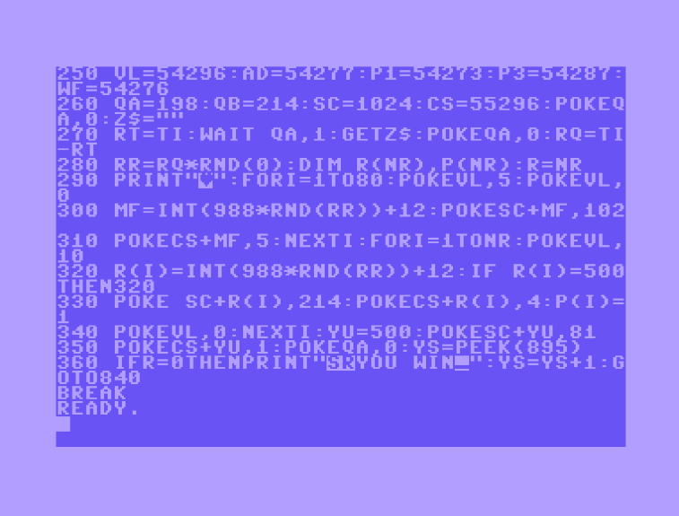

# CommodoreBasicReformatter

This tool reformats Commodore BASIC programs to make them more readable. It also support breaking multiple statements on a line into several lines for added readability.

## 1. Supported platforms

The code is written in .Net core so it should run on Windows, Linux, MAC OS

Download a binary release from https://github.com/kbilsted/CommodoreBasicReformatter/releases/ or build the source code.

## 2. Usage

    CommodoreBasicReformatter [--split-lines] <infile> <outfile>

## 3. Example

An example code from the fun game "Raging robots" found at http://www.gb64.com/game.php?id=21265

	250 vl=54296:ad=54277:p1=54273:p3=54287:wf=54276
	260 qa=198:qb=214:sc=1024:cs=55296:pokeqa,0:z$=""""
	270 rt=ti:wait qa,1:getz$:pokeqa,0:rq=ti-rt
	280 rr=rq*rnd(0):dim r(nr),p(nr):r=nr
	290 print""."":fori=1to80:pokevl,5:pokevl,0

The code is so dense. If we reformat it with our tool, it becomes

	250 vl = 54296 : ad = 54277 : p1 = 54273 : p3 = 54287 : wf = 54276
	260 qa = 198 : qb = 214 : sc = 1024 : cs = 55296 : poke qa,0 : z$ = """"
	270 rt = ti : wait qa,1 : get z$ : poke qa,0 : rq = ti-rt
	280 rr = rq*rnd(0) : dim r(nr),p(nr) : r = nr
	290 print ""."" : for i = 1 to 80 : poke vl,5 : poke vl,0

which is much nicer to the eye.

### 3.1 `--split-lines`
 But we can improve readability even more by using the `--split-lines` flag. Then the code becomes

	250 vl = 54296
	251 ad = 54277
	252 p1 = 54273
	253 p3 = 54287
	254 wf = 54276
	260 qa = 198
	261 qb = 214
	262 sc = 1024
	263 cs = 55296
	264 poke qa,0
	265 z$ = """"
	270 rt = ti
	271 wait qa,1
	272 get z$
	273 poke qa,0
	274 rq = ti-rt
	280 rr = rq*rnd(0)
	281 dim r(nr),p(nr)
	282 r = nr
	290 print "".""
	291 for i = 1 to 80
	292 poke vl,5
	293 poke vl,0

Not all lines are split, however. Then-blocks are excluded as it would change the semantics if the code. For example, the line:

    390 da=asc(d$) :ifda=145thendp=-40:goto480

becomes

    390 da = asc(d$)
    391 if da = 145 then dp =-40 : goto 480

## 4. How it works

We've made a simple parser using the following grammar
    
     PROGRAM ::= ( NEWLINE | LINE )*
     LINE    ::= DIGIT STMTS NEWLINE
     STMTS   ::= STMT ( COLON STMT )* 
     STMT    ::= ( KEYWORD | DIGIT | STRING | SYMBOL )+
     KEYWORD ::= 'to' | 'then' | 'end' | 'for' | 'next' | 'data' | 'dim' | 'read' | 'let' | 'goto' | ...
     SYMBOL  ::= ',' | '+' | '-' | '*' | '/' | '(' | ')' | '=' | '<' | '>' | '<>' | ';' | '#'
     STRING  ::= 'a'..'z' ( 'a'..'z' | '0'..'9' | '%' | '$' )*
     DIGIT   ::= ( 0 | 1 | 2 | 3 | 4 | 5 | 6 | 7 | 8 | 9 )+
     NEWLINE ::= '\n'
     COLON   ::= ':'

we read the program by tokens and then ensure the program obey the grammar. 
We then optionally break-up lines into several lines and finally print the parsed code into the destination file.

## 5. Working with tape and disc files

C64 BASIC listings are easy to get hold of from the internet. Usually they come in the form of tape or disc images - thus not being readily readable. 
The VICE emulator (http://vice-emu.sourceforge.net/) comes with two essential tools `c1541.exe` and `petcat.exe` which are needed in order to read the BASIC code listings on
more modern operating systems.

### 5.1 How to extract and reformat T64 files 

Before reformatting tape files, you need to convert the tape file to a disc image, then extract to the local file system, and then run `petcat` on it.

An example with a T64 file named `RAGINGRO.T64` containing the BASIC file `raging robots`

    .\c1541.exe -format diskname,id d64 my_diskimage.d64 -attach my_diskimage.d64
    .\c1541.exe -attach my_diskimage.d64 -tape RAGINGRO.T64
    .\c1541.exe -attach my_diskimage.d64 -extract
    .\petcat.exe -o rr.ascii "raging robots"
    dotnet CommodoreBasicReformatter.dll ".\rr.ascii" rr2.ascii

to make an executable of the re-formatted program run

    .\petcat.exe -w2 -l 0x0801 -o rr2.prg rr2.ascii

then watch it run in VICE 

	x64.exe rr2.prg

### 5.2 How to extract and reformat D64 files 

Before reformatting disc files, you need to extract to the local file system, and then run `petcat` on it.

An example with a D64 file named `YADA.D64` containing the BASIC file `DD.PRG`

    .\c1541.exe -attach YADA.D64 -extract
    .\petcat.exe -o dd.ascii "dd"
    dotnet CommodoreBasicReformatter.dll ".\dd.ascii" dd2.ascii

to make an executable of the re-formatted program run

    .\petcat.exe -w2 -l 0x0801 -o dd.prg dd2.ascii

then watch it run in VICE 

	x64.exe dd2.prg

## 6. Have fun

Kasper Graversern and Jacob Dahl Pind

http://firstclassthoughts.co.uk/